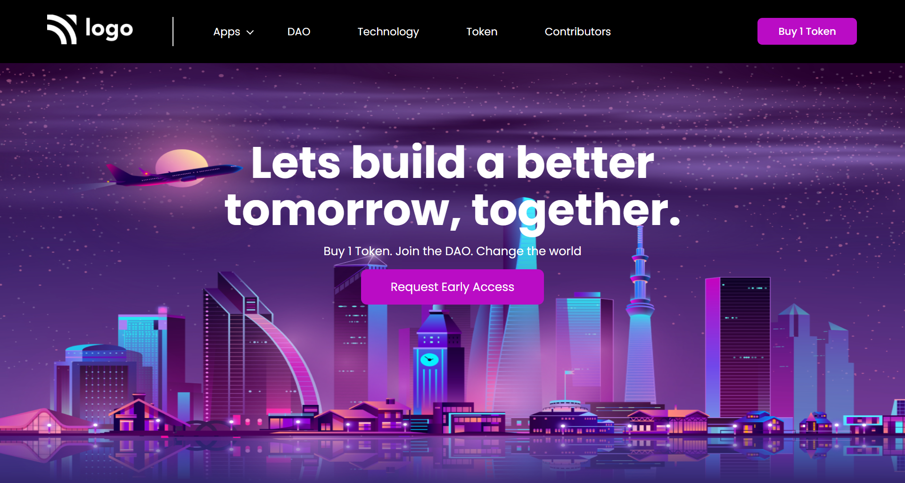

## PROJECT NAME: Crypto Landing Page

### **💻TECH STACK USED IN THIS PROJECT:** 
- 
- 

### **🛠WHAT I HAVE LEARNT IN THIS PROJECT:** 
- Setting the background image
- designing Buttons 
- Padding
- hover effect
- CSS Selectors
- CSS Flex-box
- CSS Pseudo elements(after,before)
- Positions(relative,absolute)

### **⌛TIME TAKEN TO COMPLETE THIS PROJECT:** 
- I have taken 1 hour to complete this project.

### **👀HOW MY PROJECT LOOKS LIKE:**

### 💻This Project looks good only in **Laptop Screen**(Not Responsive)

### **🚀LIVE LINK:**
-  This project is hosted on **Netlify**.You can Check it live using below link: 
-  [Project Live Link !](https://631c44675fa595130bff8f8e--singular-selkie-3a1055.netlify.app/)

